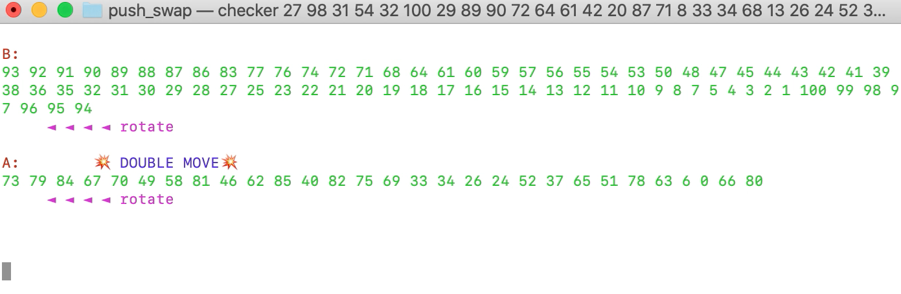

# Push_swap

A Hive Helsinki school algorithm project Push_swap:

A set of int values, 2 stacks and a set of
instructions to manipulate both stacks.
Goal is to arrange the values in stack a with the help of stack b and a set of allowed moves (*:

a simple test:

	./push_swap "2 1 3" 

create a set of random numbers from min to max (negatives :

	ARG=$(printf '%s ' `seq [min] [max] | sort -R`);

push_swap comes up with a set of instructions to arrange them:

	./push_swap $ARG

checker will return OK if push_swap's instructions worked:
	
	./push_swap $ARG | ./checker $ARG

check how many moves it takes to arrange the numbers:

	./push_swap $ARG | ./checker $ARG -z

a little visual:

	./push_swap $ARG | ./checker $ARG -g

a push_swap tester:

go to tester

	./push_swap_test.sh [amount of test rounds]
	./push_swap_test.sh [amount of test rounds] time  to check speed
	./push_swap_test.sh [amount of test rounds] norm  to check norm
	./push_swap_test.sh [amount of test rounds] time norm  to check speed and norm

*) the moves:

sa : swap a - swap the first 2 elements at the top of stack a. Do nothing if there is only one or no elements).

sb : swap b - swap the first 2 elements at the top of stack b. Do nothing if there is only one or no elements).

ss : sa and sb at the same time.

pa : push a - take the first element at the top of b and put it at the top of a. Do nothing if b is empty.

pb : push b - take the first element at the top of a and put it at the top of b. Do nothing if a is empty.

ra : rotate a - shift up all elements of stack a by 1. The first element becomes the last one.

rb : rotate b - shift up all elements of stack b by 1. The first element becomes the last one.

rr : ra and rb at the same time.

rra : reverse rotate a - shift down all elements of stack a by 1. The last element becomes the first one.

rrb : reverse rotate b - shift down all elements of stack b by 1. The last element becomes the first one.

rrr : rra and rrb at the same time

